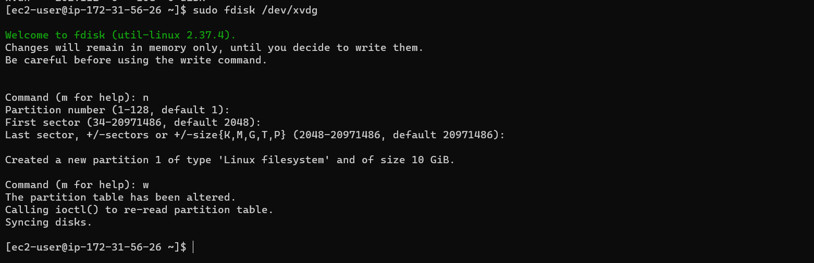
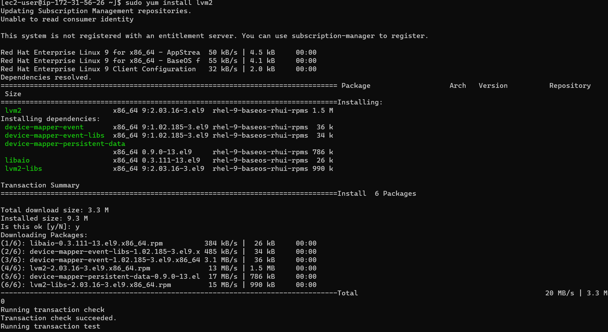
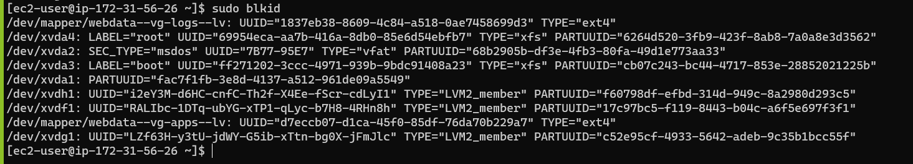
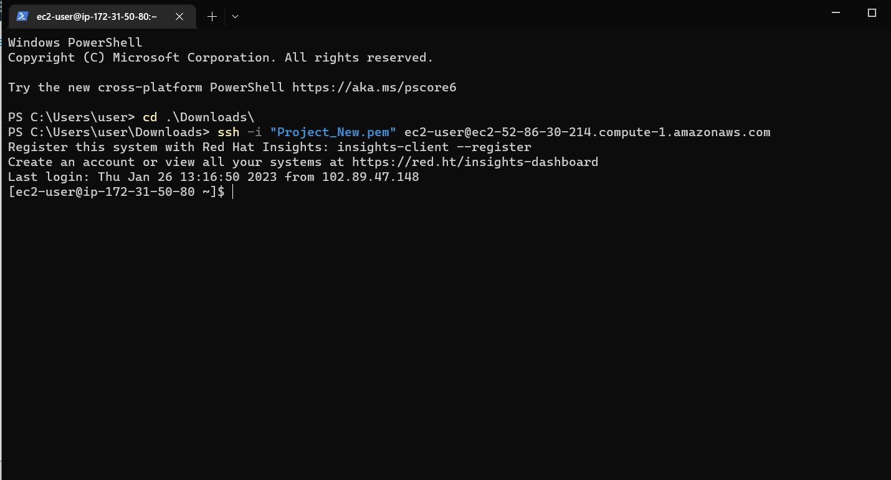

#### STEP 1 Prepare a Web Server
> Launch an Ec2 instance with linux Redhat distribution
> Edit your inbound rules and add SSH to be able to access with SSH


> Create three volumes of 10gib and attach to the instance 


> Connect to your instance on your terminal


> Run lsblk on the terminal to show what block devices are attached to server

> Check for free space on server and see all mounts

    df -h


> Create a single partition in each of the disks

    sudo fdisk /dev/xvdf
    sudo fdisk /dev/xvdg
    sudo fdisk /dev/xvdh





> View the newly configured partition

    lsblk


> Install lvm2 package

    sudo yum install lvm2
    sudo lvmdiskscan




> Create physical volumes of each disks

    sudo pvcreate /dev/xvdf1
    sudo pvcreate /dev/xvdg1
    sudo pvcreate /dev/xvdh1


> Ensure creating of physical volumes was successful

    sudo pvs


> Use vgcreate utility to add the pvs's to a volune group

    sudo vgcreate webdata-vg /dev/xvdh1 /dev/xvdg1 /dev/xvdf1 


> Verify the VG has created successful

    sudo vgs


> Create two logical volumes for storing data of the website and storing data for logs 

    sudo lvcreate -n apps-lv -L 14G webdata-vg
    sudo lvcreate -n logs-lv -L 14G webdata-vg

> Verify the logical volume has been created 

    sudo lvs


> Verify the entire setup 

    sudo vgdisplay -v #view complete setup - VG, PV, and LV
    sudo lsblk 


> Use mkfs.ext4 to format the logical volumes 

    sudo mkfs -t ext4 /dev/webdata-vg/apps-lv
    sudo mkfs -t ext4 /dev/webdata-vg/logs-lv


> Create /var/www/html directory to store website files

    sudo mkdir -p /var/www/html

> Mount /var/www/html on apps-lv logical volume

    sudo mount /dev/webdata-vg/apps-lv /var/www/html/

> Use rsync utility to backup all the files in the log directory /var/log into /home/recovery/logs 

    sudo rsync -av /var/log/. /home/recovery/logs/


> Mount /var/log on logs-lv logical volume

    sudo mount /dev/webdata-vg/logs-lv /var/log

> Restore log files back into /var/log directory

    sudo rsync -av /home/recovery/logs/. /var/log

> Update /etc/fstab file so that the mount configuration will persist after restart of the server

    sudo blkid



> Copy, paste and format the UUID of the webdata and logs

    sudo vi /etc/fstab


> Test the configuration and reload the daemon

     sudo mount -a
     sudo systemctl daemon-reload

> Verify the setup 

    df -h


#### STEP 2 - Preapare A Database Server
> Launch a second redhat ec2 instance 


> Create and attach EBS volume to the ec2 instance


> Connect the instance to your terminal to begin configuration



> Inspect what block devices are attached to the server

    lsblk


> Check to see all free space on server

        df -h


> Craete a partition on each of the 3 disks

    sudo fdisk /dev/xvdf
    sudo fdisk /dev/xvdg
    sudo fdisk /dev/xvdh


> Use lsblk to view newly configured partition 


> Install lvm2 package and check for available partitions

    sudo yum install lvm2
    sudo lvmdiskscan


> Create physical volumes to be used by LVM

    sudo pvcreate /dev/xvdf1
    sudo pvcreate /dev/xvdg1
    sudo pvcreate /dev/xvdh1


> Verify the physical volume has been successfully

    sudo pvs


> Use vgcreate utility to add all 3 PVs to a volume group

    sudo vgcreate dbdata-vg /dev/xvdh1 /dev/xvdg1 /dev/xvdf1


> Confirm the VG was successfully created

    sudo vgs


> Use lvcreate  -n db-lv -L 14G dbdata -vg

    sudo lvcreate -n db-lv -L 14G dbdata-vg
    sudo lvcreate -n logs-lv -L 14G dbdata-vg


> Verify the logical volume has been created successfully

    sudo lvs


> View the entire setup


    sudo vgdisplay -v #view complete setup - VG, PV, and LV
    sudo lsblk 


> Use mkfs.ext4 to format the Logical Volumes

    sudo mkfs -t ext4 /dev/dbdata-vg/db-lv
    sudo mkfs -t ext4 /dev/dbdata-vg/logs-lv


> Create /db directory to store website files

    sudo mkdir -p /db

> Create /home/recovery/logs to store backup of log data

    sudo mkdir -p /home/recovery/logs

> Mount /db on bd-lv logical volume

    sudo mount /dev/webdata-vg/apps-lv /var/www/html/

> Use rsync utility to backup all the files in the log directory /var/log into /home/recovery/logs

    sudo rsync -av /var/log/. /home/recovery/logs/


> Mount /var/log on logs-lv logical volume.

    sudo mount /dev/dbdata-vg/logs-lv /var/log

> Restore log files back into /var/log directory

    sudo rsync -av /home/recovery/logs/. /var/log


> Update /etc/fstab file so that the mount configuration will persist after restart of the server

 > The UUID of the device will be used to update the /etc/fstab file

    sudo blkid


> Update /etc/fstab using the UUID from the device copied from running blkid

    sudo vi /etc/fstab


> Test the configuration and reload the daemon

    sudo mount -a
    sudo systemctl daemon-reload

> Verify your setup 

    df -h


#### STEP 3 INSTALL WordPress on your Web Server EC2
> Reconnect into the webserver instance

> Update the repository

    sudo yum -y update


> Install wget, Apache and its dependencies

    sudo yum -y install wget httpd php php-mysqlnd php-fpm php-json


> Start Apache

    sudo systemctl enable httpd
    sudo systemctl start httpd


> Install PHP and its dependencies

    sudo yum install https://dl.fedoraproject.org/pub/epel/epel-release-latest-9.noarch.rpm
    sudo yum install yum-utils http://rpms.remirepo.net/enterprise/remi-release-9.rpm
    sudo yum module list php
    sudo yum module reset php
    sudo yum module enable php:remi-7.4
    sudo yum install php php-opcache php-gd php-curl php-mysqlnd
    sudo systemctl start php-fpm
    sudo systemctl enable php-fpm
    setsebool -P httpd_execmem 1

 ## Note: The commands need to be up to date with your OS version


> Restart Apache 

    sudo systemctl restart httpd

> Download wordpress and copy wordpress to car/www/html

    mkdir wordpress
    cd   wordpress
    sudo wget http://wordpress.org/latest.tar.gz
    sudo tar xzvf latest.tar.gz
    sudo rm -rf latest.tar.gz
    php wordpress/wp-config.php
    cp -R wordpress /var/www/html/


> Configure SELinux Policies

    sudo chown -R apache:apache /var/www/html/wordpress
    sudo chcon -t httpd_sys_rw_content_t /var/www/html/wordpress -R
    sudo setsebool -P httpd_can_network_connect=1

#### STEP 4 - INSTALL MySQL on your DB Server EC2
##### Note : Move to DB server

> Run basic update commands and install mysql-server

    sudo yum update
    sudo yum install mysql-server


> Verify the service is up and runnning, if it is not restart and enable it

    sudo systemctl status mysqld
    sudo systemctl restart mysqld
    sudo systemctl enable mysqld


#### STEP 5 CONFIGURE DB TO WORK WITH WORDPRRESS

```SQL
sudo mysql
CREATE DATABASE wordpress;
CREATE USER `myuser`@`<Web-Server-Private-IP-Address>` IDENTIFIED BY 'mypass';
GRANT ALL ON wordpress.* TO 'myuser'@'<Web-Server-Private-IP-Address>';
FLUSH PRIVILEGES;
SHOW DATABASES;
exit
```


#### STEP 6 CONFIGURE WORDPRESS TO CONNECT TO REMOTE DATABASE

> Open port 3306 on DB server EC2 and add the private IP address of the webserver

> cd into my.cnf and add bind address

    vi /etc/my.cnf

> Install MySQL client and test that for connection

    sudo yum install mysql
    sudo mysql -u admin -p -h <DB-Server-Private-IP-address


> Verify the connection was successfully


> Enable TCP port 80 inbound rules configuration for web server EC2


> Edit the wp-config.php

    sudo vi wp-config.php


> Try to access from browser the link to Wordpress

    http://100.25.17.142/wordpress/


